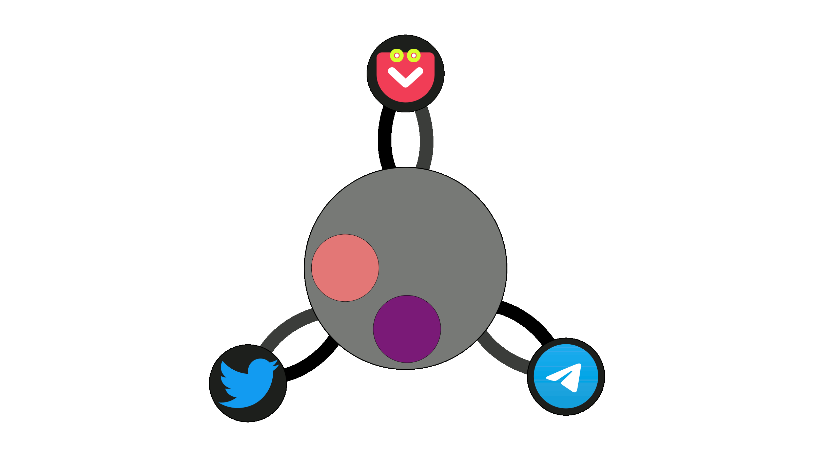
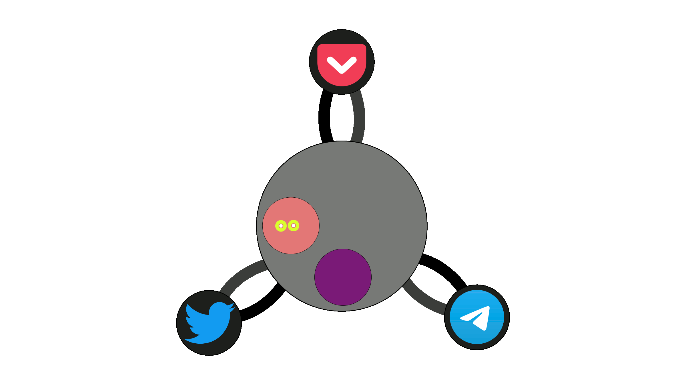

[Anterior](4Doc_Plan_Trabajo) - [Índice](Doc) - [Siguiente](6Doc_Implantación)

## 5. Diseño de la solución

### 5.1. Diseño general

El diseño de la solución propuesta es el siguiente:

Hay un script horario que se encarga de programar la ejecución de las tareas siguiendo las instrucciones establecidas en los archivos de configuración. 

El resto de scripts se encargan de realizar una tarea concreta:
- descarga de artículos de __Pocket__.
- tuitear un artículo descargado de __Pocket__.
- descargar los tweets de una cuenta de __Twitter__
- enviar un tweet descargado a un chat de __Telegram__.

Los artículos de __Pocket__ y los tweets se almacenan en buffers que funcionan como una cola FIFO.
### 5.2. Diseño detallado

El árbol de directorios es el siguiente:

```
├── buffers
│   ├── pocket-twitter.json
│   └── twitter-telegram.json
│
├── config
│   ├── credentials.json
│   ├── credentials.json.example
│   ├── authorizePocketUser.py
│   └── jobs.json
│
├── src
│   ├── actions
│   │   ├── postTelegram.py
│   │   ├── postTwitter.py
│   │   ├── readTelegram.py
│   │   └── readTwitter.py
│   │   
│   ├──control
│       ├── jobScriptRelation.json
│       ├── startPosting.py
│       └── stopPosting.py
│
├── .env
├── .env.example
└── .deploy.sh
```
Partiendo de este diagrama, se puede ir explicando cada uno de los directorios y archivos como sigue:

1. En el directorio **buffers/** se guardan los archivos __JSON__ que se usan para almacenar los datos que se van a publicar en las redes sociales, funcionan como una cola FIFO, el primer elemento que se guarda es el primero que se publica y se elimina.
    1. El archivo **buffers/pocket-twitter.json** contiene los artículos descargados de __Pocket__ que se van a publicar en __Twitter__.
    2. El archivo **buffers/twitter-telegram.json** contiene los tweets descargados de __Twitter__ que se van a publicar en __Telegram__.

2. En el directorio **config/** se guardan los archivos __JSON__ que contienen las credenciales de las cuentas de __Twitter__ y __Telegram__, los horarios de publicación y las tareas que se van a realizar.
    1. El archivo **config/credentials.json** contiene las credenciales de autenticación de las APIs de __Pocket__, __Twitter__ y __Telegram__ de cada una de las cuentas que se enlacen, con la siguiente estructura, definida en **config/credentials.json.example**:
```
{
    "pocket": {
        "<pocket_id>": {
            "email": "<email_1>",
            "access_token": "access_token_1>",
            "tags": [
                "<tag_id>",
                "<tag_id_2>"
            ]
        },
        "<pocket_id_2>": {
            "email": "<email_2>",
            "access_token": "access_token_2>",
            "tags": [
                "<tag_id>",
                "<tag_id_2>"
            ]
        }
    },
    "twitter": {
        "twitter_id_1": {
            "user_name": "<user_name_1>",
            "consumer_key": "<consumer_key_1>",
            "consumer_secret": "<consumer_secret_1>",
            "bearer_token": "<bearer_token_1>",
            "access_token": "<access_token_1>",
            "access_token_secret": "<access_token_secret_1>",
            "last_time_read": "<last_time_read_1>"
        },
        "<twitter_id_2>": {
            "user_name": "<user_name_2>",
            "consumer_key": "<consumer_key_2>",
            "consumer_secret": "<consumer_secret_2>",
            "bearer_token": "<bearer_token_2>",
            "access_token": "<access_token_2>",
            "access_token_secret": "<access_token_secret_2>",
            "last_time_read": "<last_time_read_2>"
        }
    },
    "telegram": {
        "<telegram_id_1>": {
            "chat_id": "<chat_id_1>"
        },
        "<telegram_id_2>": {
            "chat_id": "<chat_id_2>"
        }
    }
}
```
   2. El archivo **config/jobs.json** contiene un array con objetos que representan las tareas que se van a realizar y el horario en el que se van a realizar y si es necesario, una cuenta, siguiendo el siguiente formato:
  
```
[
    {
        "time": "10:50",
        "script": "READ_POCKET"
    },
    {
        "time": "10:50",
        "script": "POST_TWITTER",
        "account": "daw"
    },
    {
        "time": "10:50",
        "script": "READ_TWITTER"
    },
    {
        "time": "10:50",
        "script": "POST_TELEGRAM",
        "account": "daw"
    }
]
```

3. En el directorio **src/actions** se guardan los scripts que se van a ejecutar para realizar las tareas.

Cada script tiene un nombre que indica la tarea que realiza:

  1. El script **src/actions/readPocket.py** se encarga de publicar en __Twitter__ los enlaces que se guardan en el archivo **buffers/pocket-twitter.json**. Leerá todos los tags que se encuentren en el archivo **config/credentials.json** de todas las cuentas de __Pocket__ que se encuentren en el archivo json y las borrará de __Pocket__ una vez se hayan guardado en el archivo **buffers/pocket-twitter.json**, asociándolos a las respectivas cuentas de __Twitter__.
   



  2. El script **src/actions/readTwitter.py** se encarga de añadir el archivo **buffers/twitter-telegram.json** y el texto de todas las publicaciones de la cuenta de __Twitter__ desde la fecha almacenada en **config/credentials.json**, ambos asociados a la cuenta de __Twitter__ que se recibe como parámetro.


  3. El script **src/actions/postTwitter.py** se encarga de publicar en __Twitter__ el siguiente enlace que se encuentre en el archivo **buffers/pocket-twitter.json**. Recibe como parámetro el id de la cuenta de __Twitter__ en la que se va a publicar el enlace.



  4. El script **src/actions/postTelegram.py** se encarga de publicar en __Telegram__ el siguiente texto que se encuentre en el archivo **buffers/twitter-telegram.json**, asociado a la cuenta  que se recibe como parámetro.


4. En el directorio **src/control** se guarda el script que se va a ejecutar para programar las tareas.
   1. El script **src/control/startPosting.py** se encarga de leer el archivo **config/jobs.json** y programar las tareas que allí se encuentran, usando el archivo **src/control/jobScriptRelation.json** para relacionar las tareas con los scripts que se van a ejecutar para realizarlas.
   2. El script **src/control/stopPosting.py** se encarga de parar todas las tareas que se estén ejecutando.
   3. El archivo **src/jobScriptRelation.json** contiene un array asociativo que relaciona las claves de las tareas con los scripts que se van a ejecutar para realizar las tareas del siguiente modo:

```
{
    "READ_POCKET": "actions/readPocket.py",
    "POST_TWITER": "actions/postTwitterr.py",
    "READ_TWITTER": "actions/readTwitter.py",
    "POST_TELEGRAM": "actions/postTelegram.py"
}
```
  
5. En el archivo **.env** se guardan las variables de entorno que se usan en el proyecto, teniendo como ejemplo el archivo **.env.example**.

Para usar la tecnología __.env__ se ha usado la __librería python-dotenv__[[8]](9Doc_Referencias_Bibliografia#8).
Para las llamadas a rutas relativas entre archivos se ha usado la __librería pathlib__[[9]](9Doc_Referencias_Bibliografia#9).
Para leer los argumentos de la línea de comandos se ha usado la __librería sys__[[10]](9Doc_Referencias_Bibliografia#10).
Las tareas han sido programadas gracias a llamar al __programa at__[[11]](9Doc_Referencias_Bibliografia#11) mediante una llamada al sistema operativo usando la __librería os__[[12]](9Doc_Referencias_Bibliografia#12).
Para leer y escribir los archivos __JSON__[[13]](9Doc_Referencias_Bibliografia#13) se ha usado la __librería json__[[14]](9Doc_Referencias_Bibliografia#14).
Para llamar la __API de Twitter__[[15]](9Doc_Referencias_Bibliografia#15) se ha usado la __librería tweepy__[[16]](9Doc_Referencias_Bibliografia#16).
El uso del formato de fecha ha sido relizado mediante la __librería datetime__[[17]](9Doc_Referencias_Bibliografia#17).
La __API de Telegram__[[18]](9Doc_Referencias_Bibliografia#18) ha sido utilizada a través de peticiones http mediante la __librería requests__[[19]](9Doc_Referencias_Bibliografia#19), al igual que la __API de Pocket__[[20]](9Doc_Referencias_Bibliografia#20).

La idea original fue que se programara el script **src/control/startPosting.py** con el comando __crontab__[[21]](9Doc_Referencias_Bibliografia#21) para que se ejecute regularmente a diario y se encargue de programar las tareas que se encuentran en el archivo **config/jobs.json** para todo el día, teniendo esto en cuenta, se puede cambiar sin problemas el horario de las tareas y se actualizarán para el día siguiente, pero se llegó a la conclusión de que una opción más sencilla era que el propio script programara con __at__ la siguiente llamada a sí mismo para que se ejecute a la misma hora del día siguiente, de esta forma, se evita tener que programar el script con __crontab__ con las mismas ventajas y se pudo añadir el script de forma sencilla **src/control/stopPossting.py** para la ejecución de las tareas programadas.

[Anterior](4Doc_Plan_Trabajo) - [Índice](Doc) - [Siguiente](6Doc_Implantación)
